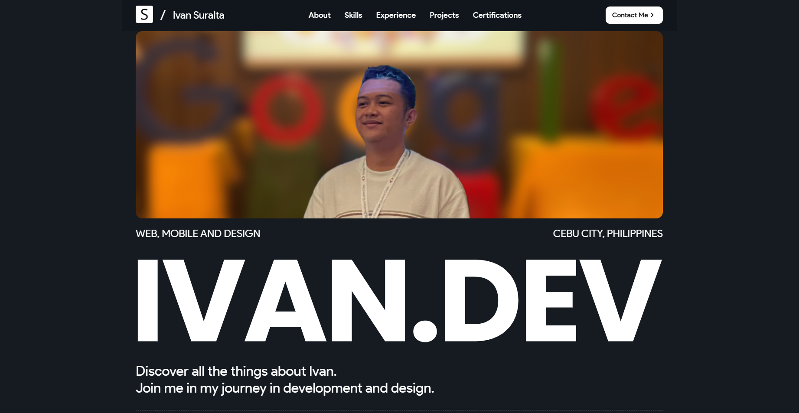

<p align="center">
    <a href="https://github.com/ivanovich18">
        
        <h2 align="center">Ivan Suralta</h2>
    </a>
</p>
<p align="center">Website Portfolio made using ReactJS</p>

<div align="center">

[](https://github.com/ivanovich18/Portfolio/actions/workflows/pages/pages-build-deployment)


</div>



_NOTE: If you choose to use this site as a template for your own website, providing a link in the footer would be greatly appreciated as credit to the creator._

## 🚀 Quick Start

**Run this site locally**

_NOTE: The default for this repo is `main`, when you push or pull make sure you specify the correct branch_

### Step 1: Clone the Repo

Fork the repository. Then, clone the repo locally by doing

```bash
git clone https://github.com/ivanovich18/Portfolio.git
```

### Step 2: Install dependencies

Change directory by typing `cd`

```bash
cd Portfolio
```

Install all dependencies

```bash
npm install
```

### Step 3: Start Development Server

Then, start the development server

```bash
npm start
```

## 📂 What's Inside?

Here is a quick look at the folder structure of this project.

    ├── build
    ├── dist
    ├── node_modules
    ├── public
    │   ├─── favicon.co
    │   ├─── index.html
    ├── src
    │   ├── assets
    │   │   ├─── favicon_io
    │   │   ├─── fonts
    │   │   ├─── others
    │   │   ├─── slider-photos
    │   ├── components
    │   │   ├── About
    │   │   │   ├── about.css
    │   │   │   ├── About.js
    │   │   ├── Certifications
    │   │   │   ├── certifications.css
    │   │   │   ├── Certifications.js
    │   │   ├── Contact
    │   │   │   ├── contact.css
    │   │   │   ├── Contact.js
    │   │   ├── Experience
    │   │   │   ├── experience.css
    │   │   │   ├── Experience.js
    │   │   ├── Footer
    │   │   │   ├── footer.css
    │   │   │   ├── Footer.js
    │   │   ├── Hero
    │   │   │   ├── hero.css
    │   │   │   ├── Hero.js
    │   │   ├── Nav
    │   │   │   ├── nav.css
    │   │   │   ├── Nav.js
    │   │   ├── Projects
    │   │   │   ├── projects.css
    │   │   │   ├── Projects.js
    │   │   ├── Skills
    │   │   │   ├── skills.css
    │   │   │   ├── Skills.js
    │   ├── App.js
    │   ├── index.js
    │   ├── style.css
    ├── .gitignore
    ├── LICENSE
    ├── package-lock.json
    ├── package.json
    ├── README.md
    ├── tailwind.config.js
    ├── tailwind.config.scss

## Tools Used

1. ReactJS
2. React-icons
3. AOS
4. EmailJS
5. Jest for Unit Testing

## 🧑🏻‍💻 Contributing

After cloning & setting up the local project, you can push the changes to your GitHub fork and make a pull request.

### Pushing the changes

```bash
git add .
git commit -m "Commit Message"
git push YOUR_REPO_URL main
```

## 🔧 Pending Fix

This web application is still on its build phase. Here are some of the things that needs to be finished:

1. Add unit tests for contact form validation.
2. Add blog component, with admin dashboard for blog.
3. Optimize assets esp. images for faster load on slow internet devices.
4. Add a modal view when clicking the project card.
5. Fix the laggy hover effect due to AOS.
6. Make the nav bar 100% wide.
7. Finalize for checking.
---

Made with ❤️ by [Ivan Suralta](https://github.com/ivanovich18)
